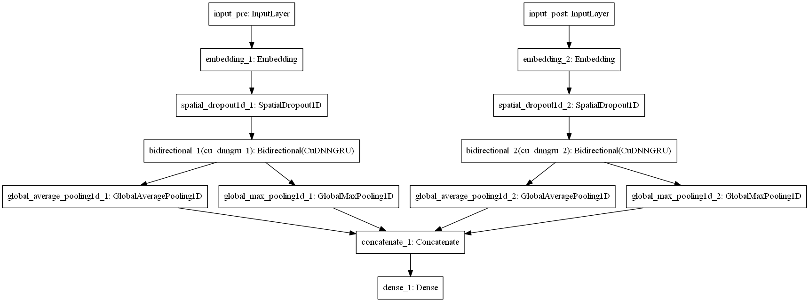
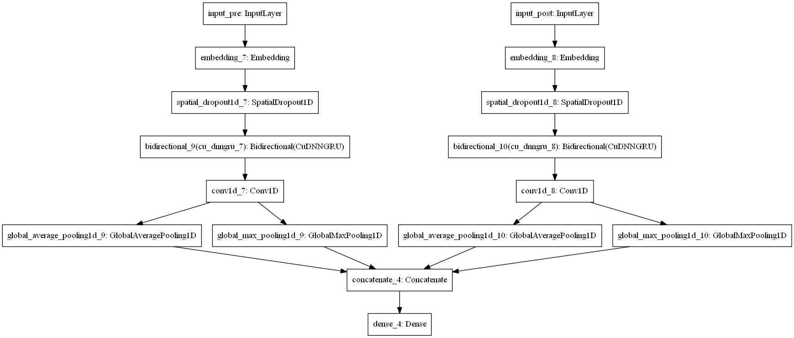
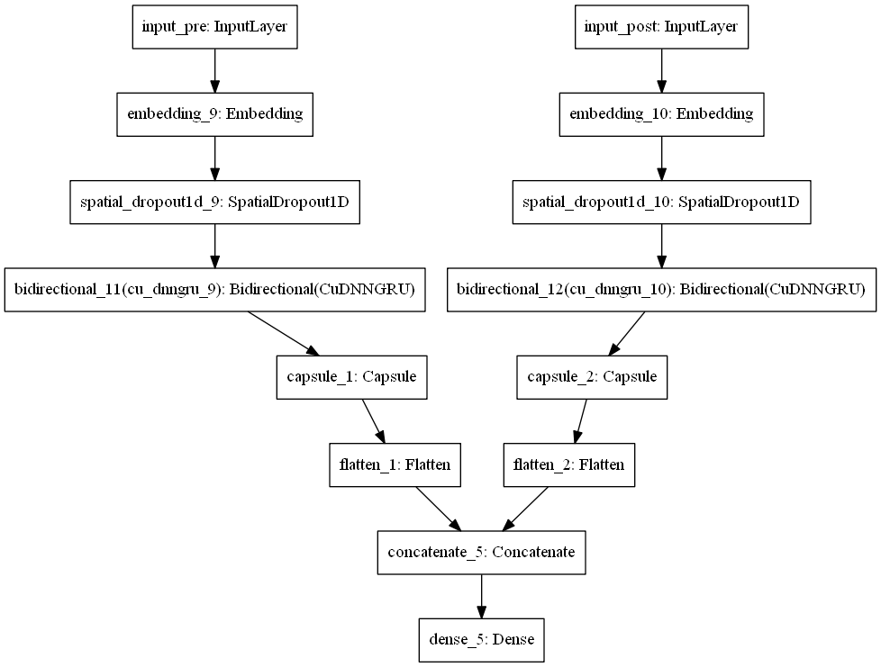
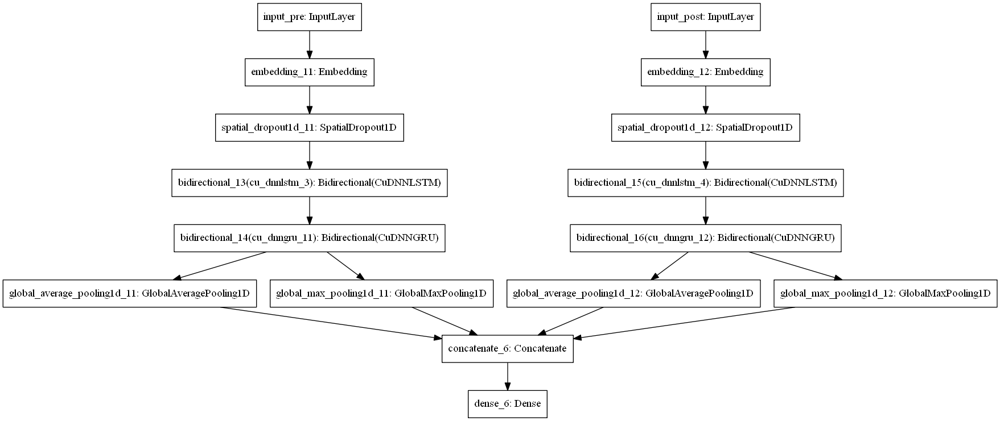
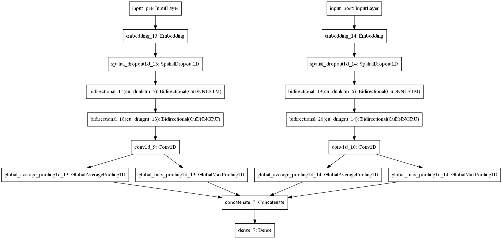

# kaggle_toxic_comment
the Code for Kaggle Competition: [Toxic Comment Classification Challenge](https://www.kaggle.com/c/jigsaw-toxic-comment-classification-challenge)
##### 476th place in Competition

## Dataset:
[The dataset](https://www.kaggle.com/c/jigsaw-toxic-comment-classification-challenge/data) is available via Kaggle competition
Unzip all data and put them into './input/' folder

## Requirements:
 * Anaconda == 5.1.0
 * python == 3.6
 * tensorflow-gpu == 1.6.0
 * keras == 2.1.5
 
 #### If you use tensorflow-cpu, you should change CuDNNGRU and CuDNNLSTM to GRU and LSTM.

##

## Pretrained Word Embeddings: 
##### Download the pretrained Vector and put it into 'emb_model' folder
  * [FastText: crawl-300d-2M](https://github.com/facebookresearch/fastText/blob/master/docs/english-vectors.md) \[[download](https://s3-us-west-1.amazonaws.com/fasttext-vectors/crawl-300d-2M.vec.zip)\]
  * [GloVe: glove.840B.300d](https://nlp.stanford.edu/projects/glove/) \[[download](http://nlp.stanford.edu/data/glove.840B.300d.zip)\]

## Code File Descriptions
  * Main.ipynb			: Main  
  * ./src/Pipeline.py		:  Load pretrained Embedding, load input and preprocessing for train and test
  * ./src/Toxic_Models.py	:  Build different deep-learning model for toxic classification 
  * ./src/Model_Trainer.py	:  Training protocol and monitoring

## Models & Results: 

| Model	| Embeddings | Public | Private	|
|:------------- |:---------- | ------- | ------ |
| |
| RNN		| fasttext		| 0.9850	| 0.9843	|
| RNN-CNN	| fasttext		| 0.9846	| 0.9842	|
| RNN-Capsule	| fasttext		| 0.9847	| 0.9842	|
| RNN-RNN	| fasttext		| 0.9857	| 0.9847	|
| RNN-RNN-CNN	| fasttext		| 0.9855	| 0.9845	|
| |
| RNN		| glove			| 0.9853	| 0.9842	|
| RNN-CNN	| glove			| 0.9854	| 0.9843	|
| RNN-Capsule	| glove			| 0.9850	| 0.9841	|
| RNN-RNN	| glove			| 0.9859	| 0.9851	|
| RNN-RNN-CNN	| glove			| 0.9857	| 0.9849	|
| |
| Ensemble	| fasttext		| 0.9857	| 0.9851	|
| Ensemble	| glove			| 0.9860	| 0.9851	|
| Ensemble	| fasttext+glove	| 0.9862	| 0.9856	|
| Ensemble	| fasttext+glove+lgbm(0.9808/0.9810)	| 0.9870	| 0.9865	|

## Model Architecture:

### RNN

### RNN-CNN

### RNN-Capsule

### RNN-RNN

### RNN-RNN-CNN

